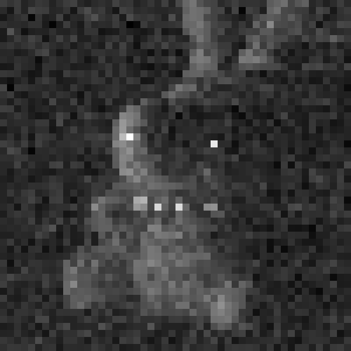
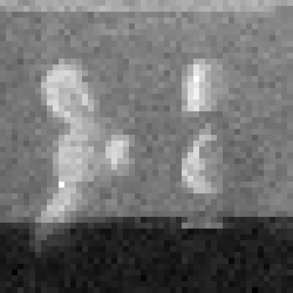

# Dual Transient Imaging

This repository contains code for SPAD (Single-Photon Avalanche Diode) dual transient imaging.


## Introduction

Dual Transient Imaging is a novel transient imaging method inspired by dual photography that reconstructs light propagation from the perspective of the illumination source using only a single-pixel SPAD (Single-Photon Avalanche Diode) sensor and a Digital Micromirror Device (DMD). 


## Examples

<p align="center">
  
</p>

<p align="center">
  
</p>


## Requirements

**Operating System**  
- Tested on MacOS and Windows

**Python Version**  
- Python 3.8+

**Python Libraries**  
- `numpy`  
- `matplotlib`  
- `scipy`  
- `glob`  
- `re`  
- `imageio`  
- `tqdm`  


## File Overview

### 1. `measureapp61-new.py`
- Projects grid patterns on the DMD, measures histograms, and saves them as `.npy` files in the `data` folder.
- **Key parameters**:
  ```python
  rows, cols = 50,50  # Resolution of the transient image
  device.acquisition_time_ms = 20000  # SPAD acquisition time
  ```
- **How to run**:
  1. Transfer the code to the lab PC.
  2. Connect the DMD to the lab PC via HDMI and set the DMD to Video Mode.
  3. Adjust parameters according to your needs.
  4. Position the SPAD, DMD, and object. Switch off lights and close booth curtains. Adjust laser settings (e.g., 50 MHz, 100% power). ⚠️ Do **not** enter the booth during the experiment—it is dangerous.
  5. Run the code and wait for it to finish.
  6. The `.npy` files will be generated in the `data` folder.

### 2. `image-generation.py`
- Generates an **accumulated image** from `.npy` files.
- **Key parameters**:
  ```python
  folder = "data/two50x50-1"  # Folder containing .npy files; must include “size x size”
  mn = 25000  # Frame count, max 25000
  group_size = 1  # group_size = 25000/mn
  c_dual = 1  # Virtual light source intensity
  def denoise_histogram(h, method="moving", window=150):  # Denoise method
  ```
- **How to run**:
  1. Put the code and `data` folder in the same directory.
  2. Change the `folder` parameter to the folder you want to process.
  3. Adjust other parameters as needed.
  4. Run the code; a `.png` accumulated image will be generated in the `data` folder.

### 3. `gif-generation.py`
- Generates a **transient animation** from `.npy` files.
- Parameters are the same as in `image-generation.py`.
- **How to run**:
  1. Put the code and `data` folder in the same directory.
  2. Change the `folder` parameter to the folder you want to process.
  3. Adjust parameters as needed.
  4. Run the code; a `.mp4` video will be generated in the `data` folder.


## Notes
- Always ensure laser safety when running experiments.  
- Adjust parameters carefully to avoid hardware damage.

